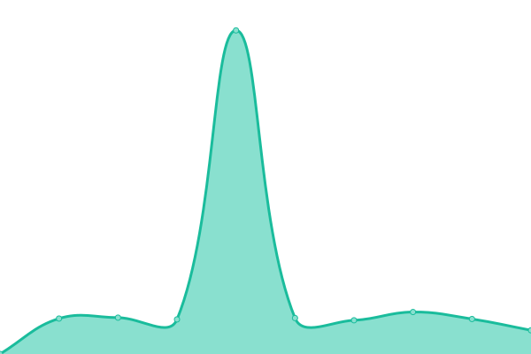
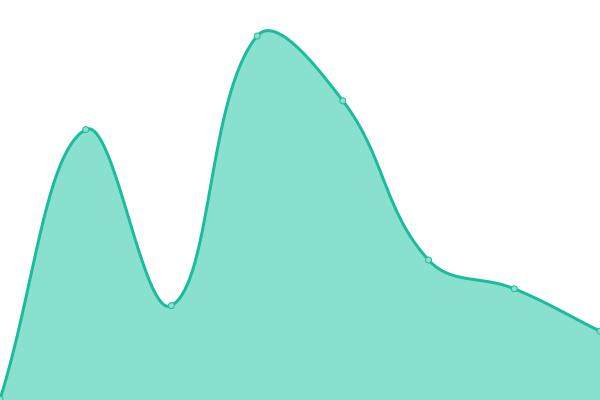

# [📈 Live Status](https://contactify-ag.github.io/upptime): <!--live status--> **🟩 All systems operational**

This repository contains the open-source uptime monitor and status page for [Contactify AG](https://www.contactify.biz), powered by [Upptime](https://github.com/upptime/upptime).

With [Upptime](https://upptime.js.org), you can get your own unlimited and free uptime monitor and status page, powered entirely by a GitHub repository. We use [Issues](https://github.com/contactify-ag/upptime/issues) as incident reports, [Actions](https://github.com/contactify-ag/upptime/actions) as uptime monitors, and [Pages](https://contactify-ag.github.io/upptime) for the status page.

<!--start: status pages-->
<!-- This summary is generated by Upptime (https://github.com/upptime/upptime) -->
<!-- Do not edit this manually, your changes will be overwritten -->
<!-- prettier-ignore -->
| URL | Status | History | Response Time | Uptime |
| --- | ------ | ------- | ------------- | ------ |
|  [Contactify Website](https://www.contactify.io) | 🟩 Up | [contactify-website.yml](https://github.com/Contactify-AG/upptime/commits/HEAD/history/contactify-website.yml) | 

 271ms
     
 | 

<a href="https://status.contactify.biz/history/contactify-website">100.00%</a>
    

|  [PROD Contactify Platform Frontend](https://contacts.contactify.biz) | 🟩 Up | [prod-contactify-platform-frontend.yml](https://github.com/Contactify-AG/upptime/commits/HEAD/history/prod-contactify-platform-frontend.yml) | 

 636ms
     
 | 

<a href="https://status.contactify.biz/history/prod-contactify-platform-frontend">100.00%</a>
    

|  [PROD Contactify Admin Frontend](https://contacts-admin.contactify.biz) | 🟩 Up | [prod-contactify-admin-frontend.yml](https://github.com/Contactify-AG/upptime/commits/HEAD/history/prod-contactify-admin-frontend.yml) | 

 614ms
     
 | 

<a href="https://status.contactify.biz/history/prod-contactify-admin-frontend">100.00%</a>
    

|  [DEV Contactify Platform Frontend](https://contacts.dev.contactify.biz) | 🟩 Up | [dev-contactify-platform-frontend.yml](https://github.com/Contactify-AG/upptime/commits/HEAD/history/dev-contactify-platform-frontend.yml) | 

 622ms
     
 | 

<a href="https://status.contactify.biz/history/dev-contactify-platform-frontend">100.00%</a>
    

|  [DEV Contactify Admin Frontend](https://contacts-admin.dev.contactify.biz) | 🟩 Up | [dev-contactify-admin-frontend.yml](https://github.com/Contactify-AG/upptime/commits/HEAD/history/dev-contactify-admin-frontend.yml) | 

 625ms
     
 | 

<a href="https://status.contactify.biz/history/dev-contactify-admin-frontend">100.00%</a>
    

|  [STAGE Contactify Platform Frontend](https://contacts-test.contactify.biz) | 🟩 Up | [stage-contactify-platform-frontend.yml](https://github.com/Contactify-AG/upptime/commits/HEAD/history/stage-contactify-platform-frontend.yml) | 

 603ms
     
 | 

<a href="https://status.contactify.biz/history/stage-contactify-platform-frontend">100.00%</a>
    

|  [STAGE Contactify Admin Frontend](https://contacts-admin-test.contactify.biz) | 🟩 Up | [stage-contactify-admin-frontend.yml](https://github.com/Contactify-AG/upptime/commits/HEAD/history/stage-contactify-admin-frontend.yml) | 

 604ms
     
 | 

<a href="https://status.contactify.biz/history/stage-contactify-admin-frontend">100.00%</a>
    

|  [PROD V2 Frontend](https://health.contactify.app/health) | 🟩 Up | [prod-v2-frontend.yml](https://github.com/Contactify-AG/upptime/commits/HEAD/history/prod-v2-frontend.yml) | 

 507ms
     
 | 

<a href="https://status.contactify.biz/history/prod-v2-frontend">100.00%</a>
    

|  [STAGE V2 Frontend](https://health.stage.contactify.app/health) | 🟩 Up | [stage-v2-frontend.yml](https://github.com/Contactify-AG/upptime/commits/HEAD/history/stage-v2-frontend.yml) | 

 500ms
     
 | 

<a href="https://status.contactify.biz/history/stage-v2-frontend">100.00%</a>
    

|  [DEV V2 Frontend](https://health.dev.contactify.app/health) | 🟩 Up | [dev-v2-frontend.yml](https://github.com/Contactify-AG/upptime/commits/HEAD/history/dev-v2-frontend.yml) | 

 491ms
     
 | 

<a href="https://status.contactify.biz/history/dev-v2-frontend">100.00%</a>
    

|  [PROD Login](https://login.contactify.app) | 🟩 Up | [prod-login.yml](https://github.com/Contactify-AG/upptime/commits/HEAD/history/prod-login.yml) | 

 636ms
     
 | 

<a href="https://status.contactify.biz/history/prod-login">100.00%</a>
    

|  [STAGE Login](https://login.stage.contactify.app) | 🟩 Up | [stage-login.yml](https://github.com/Contactify-AG/upptime/commits/HEAD/history/stage-login.yml) | 

 631ms
     
 | 

<a href="https://status.contactify.biz/history/stage-login">100.00%</a>
    

|  [DEV Login](https://login.dev.contactify.app) | 🟩 Up | [dev-login.yml](https://github.com/Contactify-AG/upptime/commits/HEAD/history/dev-login.yml) | 

 619ms
     
 | 

<a href="https://status.contactify.biz/history/dev-login">100.00%</a>
    

|  [PROD Contactify Platform API](https://contacts-api.contactify.biz/api/health) | 🟩 Up | [prod-contactify-platform-api.yml](https://github.com/Contactify-AG/upptime/commits/HEAD/history/prod-contactify-platform-api.yml) | 

 638ms
     
 | 

<a href="https://status.contactify.biz/history/prod-contactify-platform-api">99.84%</a>
    

|  [PROD Contactify Admin API](https://contacts-admin-api.contactify.biz/api/health) | 🟩 Up | [prod-contactify-admin-api.yml](https://github.com/Contactify-AG/upptime/commits/HEAD/history/prod-contactify-admin-api.yml) | 

 647ms
     
 | 

<a href="https://status.contactify.biz/history/prod-contactify-admin-api">99.84%</a>
    

|  [DEV Contactify Platform API](https://contacts-api.dev.contactify.biz/api/health) | 🟩 Up | [dev-contactify-platform-api.yml](https://github.com/Contactify-AG/upptime/commits/HEAD/history/dev-contactify-platform-api.yml) | 

 632ms
     
 | 

<a href="https://status.contactify.biz/history/dev-contactify-platform-api">99.84%</a>
    

|  [DEV Contactify Admin API](https://contacts-admin-api.dev.contactify.biz/api/health) | 🟩 Up | [dev-contactify-admin-api.yml](https://github.com/Contactify-AG/upptime/commits/HEAD/history/dev-contactify-admin-api.yml) | 

 633ms
     
 | 

<a href="https://status.contactify.biz/history/dev-contactify-admin-api">99.84%</a>
    

|  [STAGE Contactify Platform API](https://contacts-api.stage.contactify.biz/api/health) | 🟩 Up | [stage-contactify-platform-api.yml](https://github.com/Contactify-AG/upptime/commits/HEAD/history/stage-contactify-platform-api.yml) | 

 641ms
     
 | 

<a href="https://status.contactify.biz/history/stage-contactify-platform-api">99.84%</a>
    

|  [STAGE Contactify Admin API](https://contacts-admin-api.stage.contactify.biz/api/health) | 🟩 Up | [stage-contactify-admin-api.yml](https://github.com/Contactify-AG/upptime/commits/HEAD/history/stage-contactify-admin-api.yml) | 

 642ms
     
 | 

<a href="https://status.contactify.biz/history/stage-contactify-admin-api">100.00%</a>
    

|  [PROD Contactify SCIM API](https://scim-api.contactify.biz/api/health) | 🟩 Up | [prod-contactify-scim-api.yml](https://github.com/Contactify-AG/upptime/commits/HEAD/history/prod-contactify-scim-api.yml) | 

 627ms
     
 | 

<a href="https://status.contactify.biz/history/prod-contactify-scim-api">100.00%</a>
    

|  [DEV Contactify SCIM API](https://scim-api.dev.contactify.biz/api/health) | 🟩 Up | [dev-contactify-scim-api.yml](https://github.com/Contactify-AG/upptime/commits/HEAD/history/dev-contactify-scim-api.yml) | 

 626ms
     
 | 

<a href="https://status.contactify.biz/history/dev-contactify-scim-api">100.00%</a>
    

|  [STAGE Contactify SCIM API](https://scim-api.stage.contactify.biz/api/health) | 🟩 Up | [stage-contactify-scim-api.yml](https://github.com/Contactify-AG/upptime/commits/HEAD/history/stage-contactify-scim-api.yml) | 

 647ms
     
 | 

<a href="https://status.contactify.biz/history/stage-contactify-scim-api">100.00%</a>
    

|  [PROD Contactify Wallet Pass API](https://main.walletpass.api.prod.contactify.app/api/health) | 🟩 Up | [prod-contactify-wallet-pass-api.yml](https://github.com/Contactify-AG/upptime/commits/HEAD/history/prod-contactify-wallet-pass-api.yml) | 

 641ms
     
 | 

<a href="https://status.contactify.biz/history/prod-contactify-wallet-pass-api">100.00%</a>
    

|  [STAGE Contactify Wallet Pass API](https://main.walletpass.api.stage.contactify.app/api/health) | 🟩 Up | [stage-contactify-wallet-pass-api.yml](https://github.com/Contactify-AG/upptime/commits/HEAD/history/stage-contactify-wallet-pass-api.yml) | 

 619ms
     
 | 

<a href="https://status.contactify.biz/history/stage-contactify-wallet-pass-api">100.00%</a>
    

|  [DEV Contactify Wallet Pass API](https://main.walletpass.api.dev.contactify.app/api/health) | 🟩 Up | [dev-contactify-wallet-pass-api.yml](https://github.com/Contactify-AG/upptime/commits/HEAD/history/dev-contactify-wallet-pass-api.yml) | 

 634ms
     
 | 

<a href="https://status.contactify.biz/history/dev-contactify-wallet-pass-api">100.00%</a>
    

|  [Passource Wallet Pass Generator](https://www.passsource.com/api/) | 🟩 Up | [passource-wallet-pass-generator.yml](https://github.com/Contactify-AG/upptime/commits/HEAD/history/passource-wallet-pass-generator.yml) | 

 342ms
     
 | 

<a href="https://status.contactify.biz/history/passource-wallet-pass-generator">100.00%</a>
    

<!--end: status pages-->

[**Visit our status website →**](https://contactify-ag.github.io/upptime)

## 📄 License

- Powered by: [Upptime](https://github.com/upptime/upptime)
- Code: [MIT](./LICENSE) © [Contactify AG](https://www.contactify.biz)
- Data in the `./history` directory: [Open Database License](https://opendatacommons.org/licenses/odbl/1-0/)
